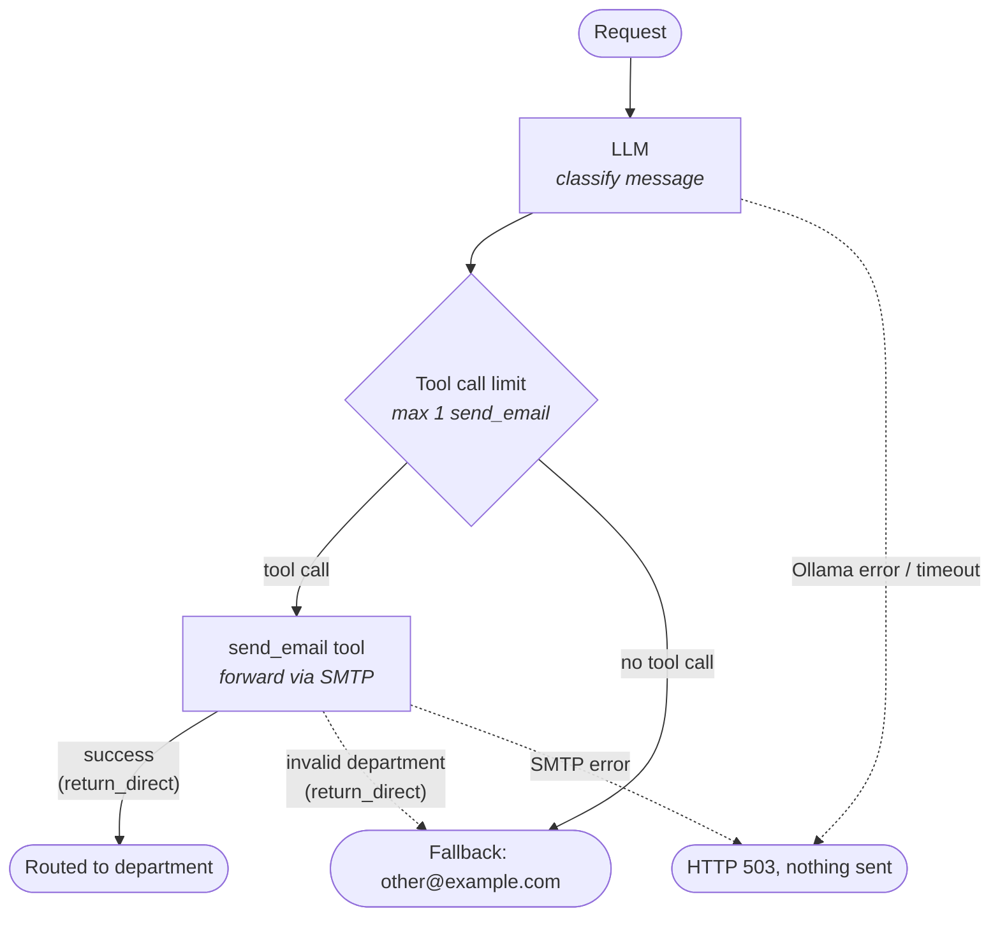

# AI Email Router PoC

Proof of Concept (PoC) that serves as an intelligent email router. The system processes free-form user messages,
classifies their intent using a locally hosted Large Language Model (LLM via Ollama),
and forwards each message to the appropriate department using AI Agent Tool Calling.

---

## Architecture Overview

The system runs as a set of Docker containers, ensuring operational isolation and data privacy by hosting the LLM locally.

```
+------------------+      POST /api/v1/messages       +----------------------+
|   HTTP Client    | -------------------------------> |   FastAPI Gateway    |
+------------------+                                  +----------------------+
                                                                 |
                                                                 v
                                                      +----------------------+
                                                      |   LangChain Agent    |
                                                      |  (Ollama: llama3.2)  |
                                                      +----------------------+
                                                                 |
                                                                 v (Tool Calling)
+------------------+         SMTP (Port 1025)         +----------------------+
| MailHog Server   | <------------------------------- |   send_email Tool    |
| (Web UI: :8025)  |                                  +----------------------+
+------------------+
```

### Core Components

1. **API Layer (FastAPI & Pydantic):** Ingests incoming HTTP requests (`POST /api/v1/messages`), validates payload schema (`email`, `subject`, `message`), and hosts interactive OpenAPI/Swagger documentation.
2. **AI Agent Core (LangChain & Ollama):**
   - Utilizes `llama3.2:3b` executing inside a dedicated container.
   - Evaluates message semantics against departmental guidelines (only the message body is shown to the LLM; the subject is not used for classification).
   - Calls the `send_email` tool, where the LLM chooses **only** the target department (constrained to the `Department` enum).
   - The sender address, subject and message body are injected from the original request via LangChain's runtime context, so the LLM cannot alter or spoof them — the message is forwarded verbatim.
   - Validates execution results via `RoutingResult`: a request is reported as routed only if the tool call actually succeeded. If the LLM picks no valid department, the message goes to the fallback inbox (`other@example.com`) and the result is marked `fallback=True`. If Ollama itself is unreachable, times out or returns an error, nothing is sent and the API returns `503`.
3. **Mail Dispatcher & Testing Server (SMTP & MailHog):** Sends routed messages over standard SMTP with the subject `[Routed] Subject:<original subject>` and the original sender address in the `Reply-To` header, captured by the MailHog test mailbox.

### Agent Flow

`create_agent` compiles the agent into a LangGraph state graph. A single request flows through it as follows:



- The **LLM** sees only the message body and chooses the department.
- The **tool call limit** (`ToolCallLimitMiddleware`) blocks any extra `send_email` call, so a request never sends more than one email.
- The **tool** receives the sender, subject and original body from runtime context, not from the LLM, so they are forwarded unchanged.
- Because `send_email` is `return_direct`, the graph ends after the tool runs even if it failed (e.g. invalid department), so the model never retries.
- The **fallback** step runs in `RoutingAgent.process()` after the graph: a message the model couldn't classify is sent to `other@example.com`.
- **Infrastructure failures** (Ollama or SMTP down) send nothing and return `503`, so misrouted mail never piles up in the fallback inbox. This also applies to the fallback send: if SMTP fails there, the API returns `503`.

### Project Structure

```
app/
├── main.py              # FastAPI app, health check
├── api/routes.py        # POST /api/v1/messages
├── agent/
│   ├── agent.py         # RoutingAgent: LLM setup, invocation, result validation
│   ├── tools.py         # send_email tool + EmailContext (runtime-injected request data)
│   └── prompts.py       # System prompt with routing rules
├── core/
│   ├── config.py        # Settings (env vars / .env)
│   └── logger.py        # Logging setup
├── models/models.py     # Pydantic models, Department enum
└── services/mail_service.py  # SMTP sending
```

---

## Department Routing Matrix

| Department | Target Recipient | Scope & Responsibility |
| :--- | :--- | :--- |
| **IT Support** | `it@example.com` | Hardware and printer issues, network/VPN connectivity, software installation and troubleshooting |
| **Help Desk** | `help-desk@example.com` | Password resets, account lockouts, account access issues |
| **Human Resources** | `human-resources@example.com` | Recruitment and hiring, vacation/PTO and leave requests |
| **Payroll & Personnel** | `kadry@example.com` | Payroll and salary inquiries, employment contracts, tax documents, HR paperwork |
| **Fallback (Other)** | `other@example.com` | Anything that doesn't clearly fit above, or ambiguous requests |

The routing rules live in `app/agent/prompts.py` — keep this table in sync when changing them.

---

## Quickstart Guide

### Prerequisites
- [Docker](https://docs.docker.com/get-docker/) (v24.0+)
- [Docker Compose](https://docs.docker.com/compose/) (v2.20+)

### 1. Launch Environment

Execute the following command in the project root directory:

```bash
docker compose up -d
```

The orchestration setup automatically:
- Starts the **Ollama** engine service.
- Initializes model provisioning (`llama3.2:3b`) via `ollama-init`.
- Starts the **MailHog** SMTP server and Web UI.
- Builds and runs the **FastAPI** application container.

> **Note:** On the first start the model (~2 GB) is downloaded. The `api` container starts only after `ollama-init` has finished successfully, so the API is unreachable until then — follow progress with `docker compose logs -f ollama-init`.

---

## Service Endpoints & Interfaces

| Interface | URL | Description |
| :--- | :--- | :--- |
| **Swagger UI** | [http://localhost:8000/api/v1/docs](http://localhost:8000/api/v1/docs) | Interactive API exploration and test client |
| **OpenAPI Specification** | [http://localhost:8000/api/v1/openapi.json](http://localhost:8000/api/v1/openapi.json) | Raw OpenAPI schema JSON |
| **MailHog Web UI** | [http://localhost:8025](http://localhost:8025) | Webmail console for inspecting routed emails |
| **Health Check** | [http://localhost:8000/health](http://localhost:8000/health) | Service operational status endpoint |

---

## Usage Examples

### 1. Hardware Issue (Routed to IT)

```bash
curl -X POST http://localhost:8000/api/v1/messages \
  -H "Content-Type: application/json" \
  -d '{
    "email": "john.doe@company.com",
    "subject": "Monitor not working",
    "message": "My primary workstation monitor has failed and does not turn on."
  }'
```

**Response:**
```json
{
  "status": "success",
  "routed_to": "it@example.com"
}
```

`routed_to` is the inbox the message was delivered to — `other@example.com` if the model could not classify it.

### 2. Authentication Problem (Routed to Help Desk)

```bash
curl -X POST http://localhost:8000/api/v1/messages \
  -H "Content-Type: application/json" \
  -d '{
    "email": "alice.smith@company.com",
    "subject": "ERP account locked",
    "message": "I entered an incorrect password multiple times and my ERP account is locked. Please unlock it."
  }'
```

### 3. Vacation Policy Inquiry (Routed to Human Resources)

```bash
curl -X POST http://localhost:8000/api/v1/messages \
  -H "Content-Type: application/json" \
  -d '{
    "email": "robert.johnson@company.com",
    "subject": "Annual leave balance",
    "message": "Could you please clarify the remaining annual leave allowance for this calendar year?"
  }'
```

### 4. Payroll Certificate Request (Routed to Kadry)

```bash
curl -X POST http://localhost:8000/api/v1/messages \
  -H "Content-Type: application/json" \
  -d '{
    "email": "emily.davis@company.com",
    "subject": "Earnings certificate",
    "message": "Please generate and issue an official earnings certificate for my bank mortgage application."
  }'
```

### Error Responses

| Status | When |
| :--- | :--- |
| `200 OK` | Message delivered — to the chosen department, or to the fallback inbox `other@example.com` if the model couldn't classify it |
| `422 Unprocessable Entity` | Invalid payload (missing field, bad email, message shorter than 3 or longer than 5000 characters) |
| `503 Service Unavailable` | Ollama (`LLM unavailable`) or the SMTP server (`Mail server unavailable`) is down, timed out or returned an error. Nothing is sent — retry later |
| `500 Internal Server Error` | Any other unexpected failure |

---

## Inspecting Dispatched Emails

1. Navigate to **[http://localhost:8025](http://localhost:8025)** in your browser.
2. Select any newly arrived email to inspect delivery details:
   - **Recipient (`To`):** Assigned department address (e.g., `it@example.com`).
   - **Sender (`From`):** `routing-agent@example.com`.
   - **Reply-To:** Original request sender address (e.g., `john.doe@company.com`).
   - **Subject:** `[Routed] Subject:` followed by the request `subject`.
   - **Content:** Exact user message payload.

---

## Configuration

Settings are read from environment variables (or a `.env` file in the working directory, see `.env.example`) by `app/core/config.py`:

| Variable | Default | Description |
| :--- | :--- | :--- |
| `OLLAMA_HOST` | `http://ollama:11434` | Ollama server URL |
| `MODEL_NAME` | `llama3.2:3b` | Ollama model used for classification |
| `LLM_TIMEOUT` | `60` | Timeout for LLM requests, in seconds |
| `SMTP_HOST` | `mailhog` | SMTP server hostname |
| `SMTP_PORT` | `1025` | SMTP server port |
| `SENDER_EMAIL` | `routing-agent@example.com` | `From` address of forwarded emails |

> **Note:** `ollama-init` in `docker-compose.yml` always pulls `llama3.2:3b`. If you change `MODEL_NAME`, update the pull command there as well.

---

## Local Development (Without Full Dockerization)

To run the API locally with hot-reloading for rapid iteration (requires Python 3.11+ and [uv](https://docs.astral.sh/uv/)):

1. **Install dependencies:**
   ```bash
   uv sync
   ```

2. **Start auxiliary services:**
   ```bash
   docker compose up -d ollama ollama-init mailhog
   ```

3. **Point the app at localhost.** The defaults in `app/core/config.py` use Docker service hostnames (`ollama`, `mailhog`), which don't resolve outside Docker. Create a `.env` file in the project root:
   ```env
   OLLAMA_HOST=http://localhost:11434
   SMTP_HOST=localhost
   SMTP_PORT=1025
   ```

4. **Run development server:**
   ```bash
   uv run uvicorn app.main:app --reload --port 8000
   ```

### Running Tests

Tests live in `sample_tests/` and don't need Docker services running. `uv sync` installs `pytest` from the `dev` dependency group (it is not included in the Docker image):

```bash
uv run pytest
```

> **Note:** The Docker image installs the exact versions pinned in `uv.lock` (`uv sync --frozen`). After changing dependencies in `pyproject.toml`, run `uv lock` and commit the updated `uv.lock`, otherwise the image build fails.
